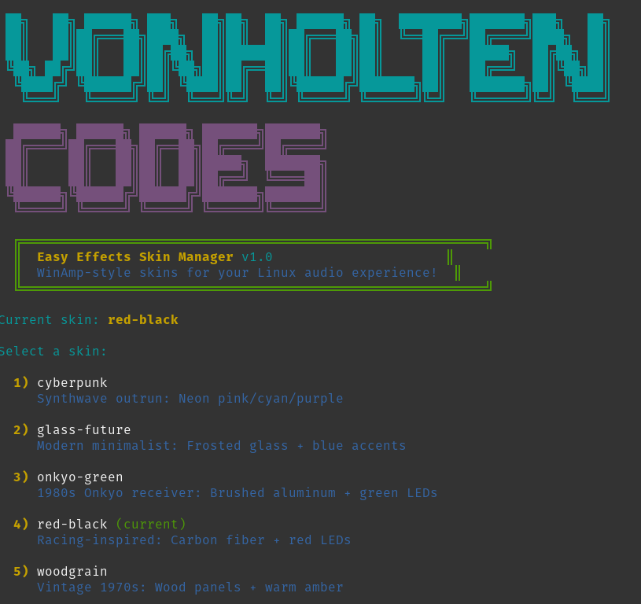
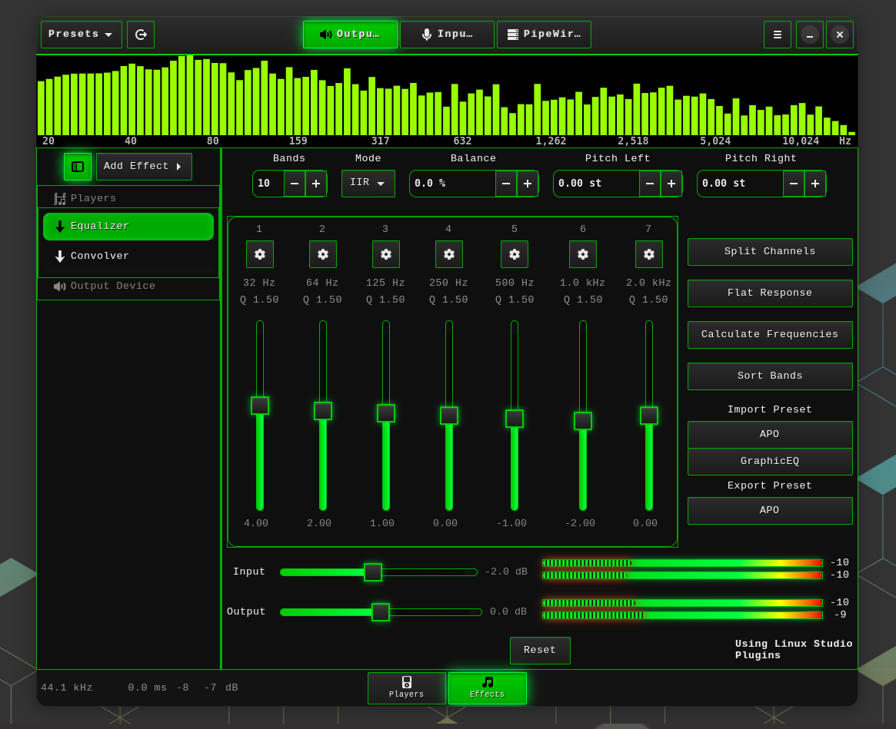
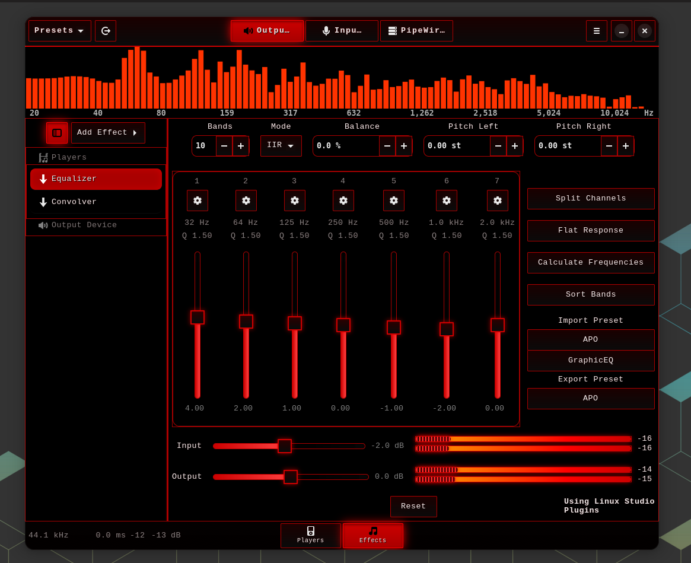
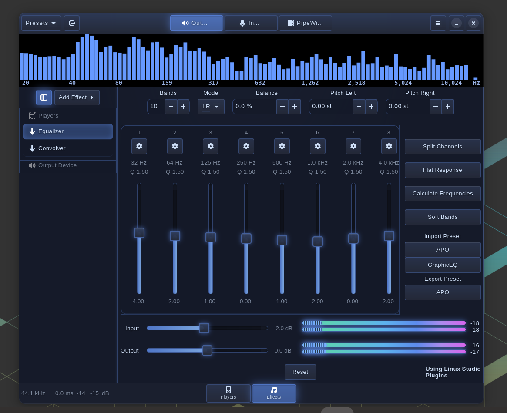
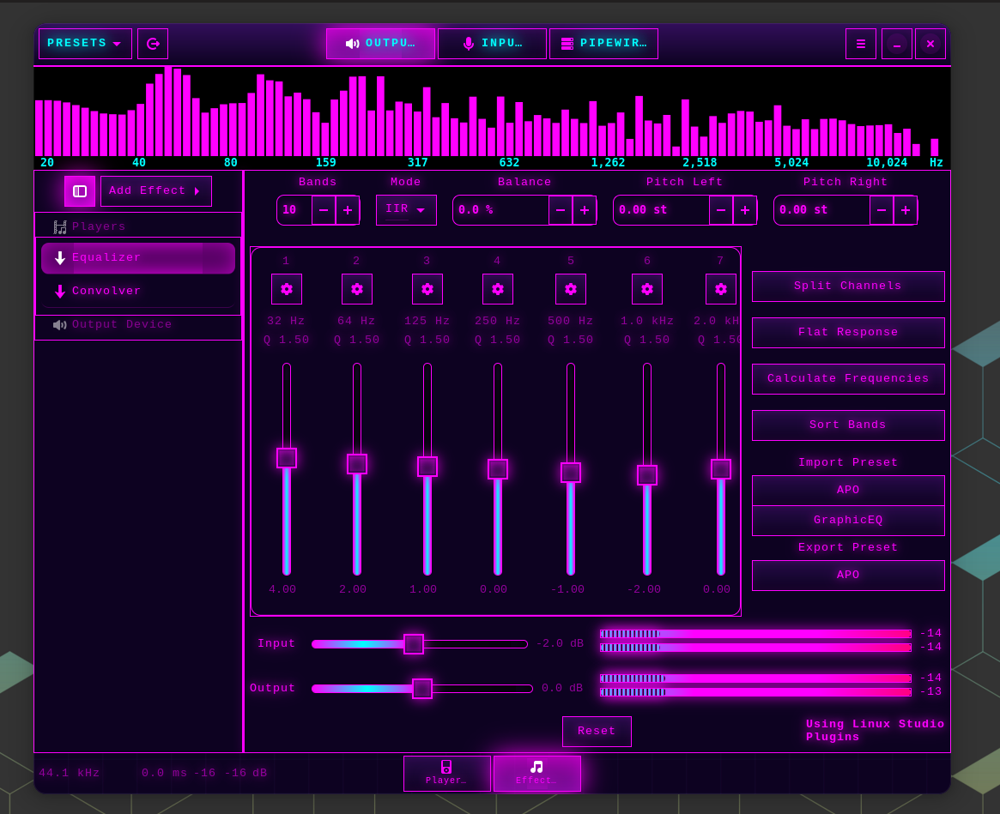
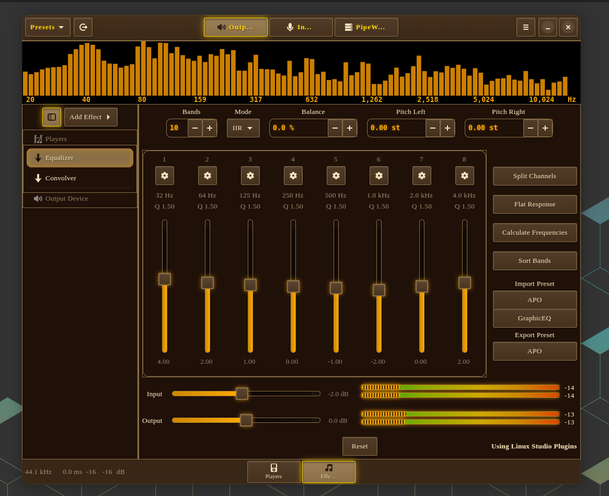

# Easy Effects Skins

**WinAmp-style skins for Easy Effects on Linux!**

Transform your Easy Effects interface with custom themes inspired by classic audio equipment and modern design aesthetics. Just like WinAmp skins, but for your Linux audio processing!


## 🎮 Interactive Skin Manager

Easy-to-use interactive menu for switching skins on the fly:



## 🎨 Available Skins

### 1. Onkyo Green
**1980s Hi-Fi Receiver Aesthetic**
- Brushed black aluminum chassis
- White screenprinted labels
- Green LED indicators and borders
- Lime green spectrum analyzer
- Inspired by classic Onkyo receivers



### 2. Red Black
**Racing-Inspired Aggressive Style**
- Carbon fiber texture
- Red LED indicators
- Deep black background
- Orange-to-red VU meters
- Performance-focused design



### 3. Glass Future
**Modern Minimalist Design**
- Frosted glass effects
- Blue accent colors
- Transparency and blur
- Clean, professional look
- Perfect for modern desktops



### 4. Cyberpunk
**Neon Synthwave Outrun**
- Hot pink and cyan neon colors
- Purple accent lighting
- Grid-pattern background
- Intense glow effects
- Pure 1980s cyberpunk aesthetic



### 5. Woodgrain
**Vintage 1970s Hi-Fi**
- Wood panel texture
- Warm amber LED displays
- Gold accents
- Classic wood grain pattern
- Retro warmth and nostalgia



### 6. EasyAmp
**Classic media-player tribute**
- Beveled gunmetal chrome
- Green 7-segment LCD readouts
- EQ-style sliders (green→amber→red) with a beveled grip
- Green spectrum bars on black
- A loving nod to late-90s players — original art, no trademarked assets

> Looks best with two optional OFL fonts installed to `~/.local/share/fonts`:
> **DSEG7 Classic** (7-segment LCD) and **Pixelify Sans** (pixel chrome).
> Without them it falls back to monospace/sans cleanly.

## 📋 Requirements

- **Easy Effects** (installed via Flatpak)
- **Linux** (tested on Pop!_OS 22.04, should work on most distros)
- **GTK4** support
- **Bash** shell

## 🚀 Installation

### Quick Install

```bash
# Clone the repository
git clone https://github.com/VonHoltenCodes/easyeffects-skins.git
cd easyeffects-skins

# Run the installer
chmod +x install.sh
./install.sh
```

### Manual Installation

1. **Create the skins directory:**
   ```bash
   mkdir -p ~/.var/app/com.github.wwmm.easyeffects/config/gtk-4.0/themes
   ```

2. **Copy skin files:**
   ```bash
   cp skins/*.css ~/.var/app/com.github.wwmm.easyeffects/config/gtk-4.0/themes/
   ```

3. **Install the skin manager:**
   ```bash
   mkdir -p ~/bin
   cp easyeffects-skin ~/bin/
   chmod +x ~/bin/easyeffects-skin
   ```

4. **Add ~/bin to your PATH (if not already):**
   ```bash
   echo 'export PATH="$HOME/bin:$PATH"' >> ~/.bashrc
   source ~/.bashrc
   ```

## 🎮 Usage

### Interactive Menu (Recommended)

Simply run:
```bash
easyeffects-skin
```

This will launch an interactive menu where you can select your desired skin.

### Command Line

**List all available skins:**
```bash
easyeffects-skin list
```

**Show currently active skin:**
```bash
easyeffects-skin current
```

**Apply a specific skin:**
```bash
easyeffects-skin apply cyberpunk
```

**Quick switches (direct skin names):**
```bash
easyeffects-skin onkyo-green
easyeffects-skin red-black
easyeffects-skin glass-future
easyeffects-skin cyberpunk
easyeffects-skin woodgrain
```

## 🛠️ How It Works

The skin manager:
1. **Applies CSS** - Copies the selected skin's CSS to Easy Effects' active configuration
2. **Sets spectrum colors** - Configures spectrum analyzer colors via gsettings
3. **Restarts Easy Effects** - Gracefully stops and restarts Easy Effects to apply changes

Each skin includes:
- Custom GTK4 CSS styling
- Spectrum analyzer color configuration
- Axis label color configuration
- Complete theme consistency

## 🎨 Creating Your Own Skins

Want to create your own skin? It's easy!

1. **Copy an existing skin as a template:**
   ```bash
   cp skins/onkyo-green.css skins/my-custom-skin.css
   ```

2. **Edit the CSS** - Modify colors, backgrounds, borders, shadows, etc.

3. **Add spectrum colors to the script** - Edit `easyeffects-skin` and add your skin's colors to the `SPECTRUM_COLORS` and `AXIS_COLORS` arrays

4. **Test it:**
   ```bash
   cp skins/my-custom-skin.css ~/.var/app/com.github.wwmm.easyeffects/config/gtk-4.0/themes/
   easyeffects-skin apply my-custom-skin
   ```

## 🤝 Contributing

Contributions are welcome! If you create a cool skin, please share it:

1. Fork the repository
2. Add your skin CSS file to the `skins/` directory
3. Add a screenshot to `screenshots/`
4. Update this README with your skin description
5. Submit a pull request

## 📸 Screenshots

All screenshots are taken with the same Easy Effects preset to show the pure visual differences between skins. Screenshots should be named:
- `onkyo-green.png`
- `red-black.png`
- `glass-future.png`
- `cyberpunk.png`
- `woodgrain.png`

## 📄 License

MIT License - See [LICENSE](LICENSE) file for details

This project is completely open source and free to use, modify, and distribute.

## 🙏 Credits

**Created by:** [VonHoltenCodes](https://github.com/VonHoltenCodes)

**Inspired by:**
- WinAmp skins (the original customizable audio player)
- Classic 1970s-1980s Hi-Fi equipment
- Modern UI/UX design trends
- Retro computing aesthetics

## 💬 Support

If you encounter issues or have suggestions:
- Open an issue on GitHub
- Check existing issues for solutions
- Contribute fixes via pull requests

## 🌟 Show Your Support

If you like this project:
- ⭐ Star the repository
- 🍴 Fork it and create your own skins
- 📢 Share it with the Linux audio community
- 💡 Submit your custom skins

## 📝 Changelog

### v1.0.0 (2025-11-08)
- Initial release
- 5 custom skins included
- Interactive skin manager
- Automatic Easy Effects restart
- Full spectrum analyzer integration

---

**Made with ❤️ for the Linux audio community**
